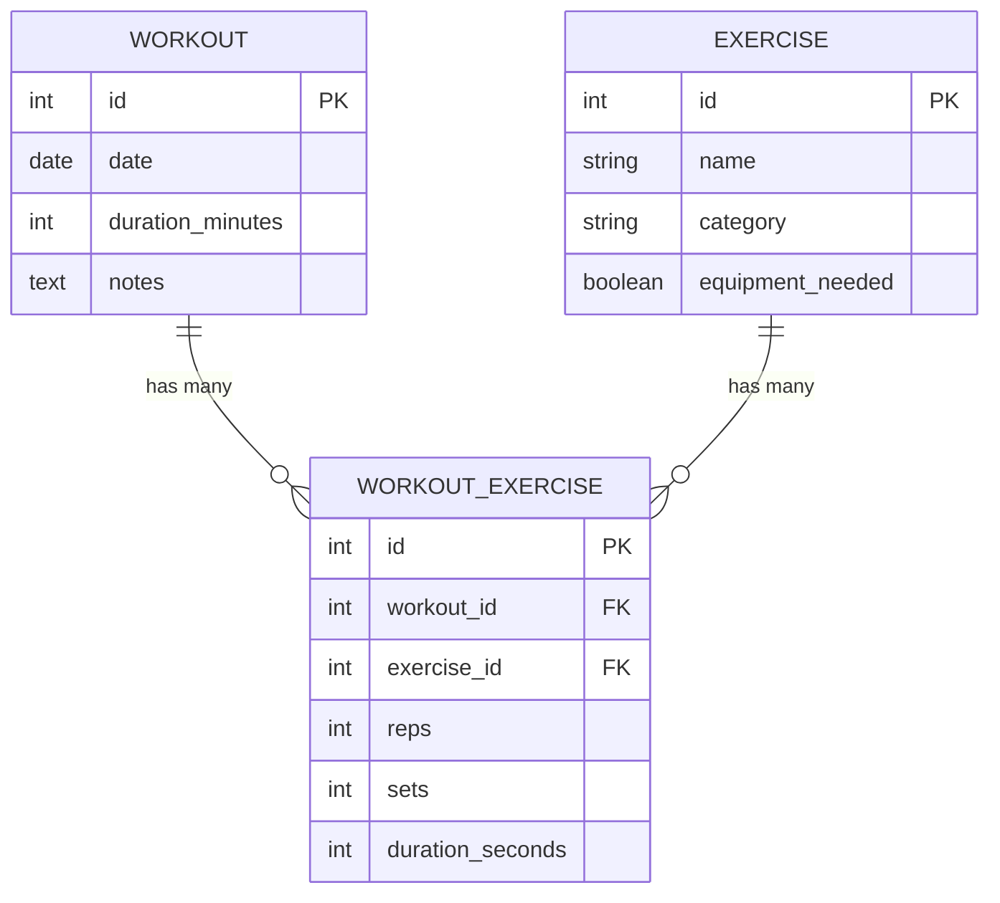

# Workout Tracker API

## Description

A backend API for a workout tracking application used by personal trainers.
The API tracks **Workouts** and reusable **Exercises**, linking them through
a **WorkoutExercise** join model that stores per-exercise reps, sets, and
duration for a given workout.

Built with Flask, Flask-SQLAlchemy, Flask-Migrate, and Marshmallow.

### Models & Relationships

- An `Exercise` has many `WorkoutExercises`, and has many `Workouts` through `WorkoutExercises`.
- A `Workout` has many `WorkoutExercises`, and has many `Exercises` through `WorkoutExercises`.
- A `WorkoutExercise` belongs to a `Workout` and belongs to an `Exercise`.

`Workout` and `Exercise` are each in a **one-to-many** relationship with
`WorkoutExercise` (the join table), and `WorkoutExercise` is what turns
`Workout` and `Exercise` into a **many-to-many** relationship with each
other:



### Validations

- **Table constraints:** exercise `category` restricted to a known set, workout
  `duration_minutes` must be positive, `reps`/`sets` on a `WorkoutExercise`
  must be positive.
- **Model validations:** exercise `name` cannot be blank, `category` must be
  a known value, `duration_minutes` must be a positive integer, `reps`/`sets`/
  `duration_seconds` cannot be negative or zero.
- **Schema validations:** required fields on `name`/`category`/`date`/
  `duration_minutes`, `Length` on name, `OneOf` on category, `Range` on
  numeric fields.

## Installation

1. Clone the repo and move into the `server/` directory.
2. Install dependencies:
   ```
   pipenv install
   pipenv shell
   ```
3. Initialize and run migrations:
   ```
   flask db init
   flask db migrate -m "initial migration"
   flask db upgrade head
   ```
4. Seed the database:
   ```
   python seed.py
   ```

## Running the App

```
flask run
```
or
```
python app.py
```

The API runs on `http://localhost:5555`.

## Endpoints

| Method | Route | Description |
|---|---|---|
| GET | `/workouts` | List all workouts |
| GET | `/workouts/<id>` | Show a single workout, including its associated exercises (with reps/sets/duration) |
| POST | `/workouts` | Create a workout. Body: `{ "date": "YYYY-MM-DD", "duration_minutes": int, "notes": str }` |
| DELETE | `/workouts/<id>` | Delete a workout (also deletes its associated `WorkoutExercises`) |
| GET | `/exercises` | List all exercises |
| GET | `/exercises/<id>` | Show a single exercise and the workouts its associated with |
| POST | `/exercises` | Create an exercise. Body: `{ "name": str, "category": str, "equipment_needed": bool }` |
| DELETE | `/exercises/<id>` | Delete an exercise (also deletes its associated `WorkoutExercises`) |
| POST | `/workouts/<workout_id>/exercises/<exercise_id>/workout_exercises` | Add an exercise to a workout. Body: `{ "reps": int, "sets": int, "duration_seconds": int }` (all optional) |

### Valid exercise categories
`Cardio`, `Strength`, `Flexibility`, `Balance`
